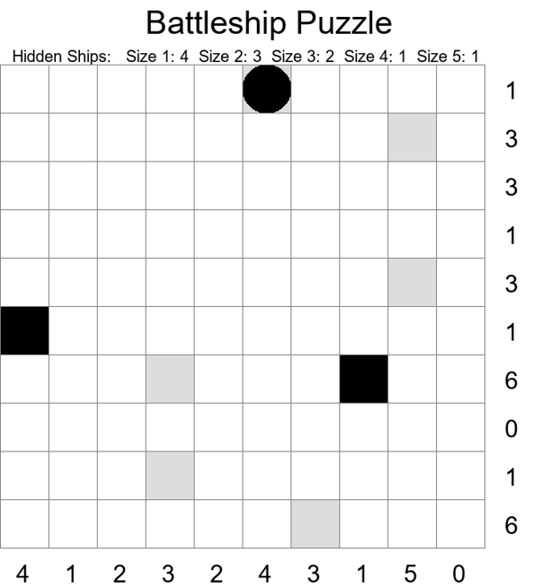
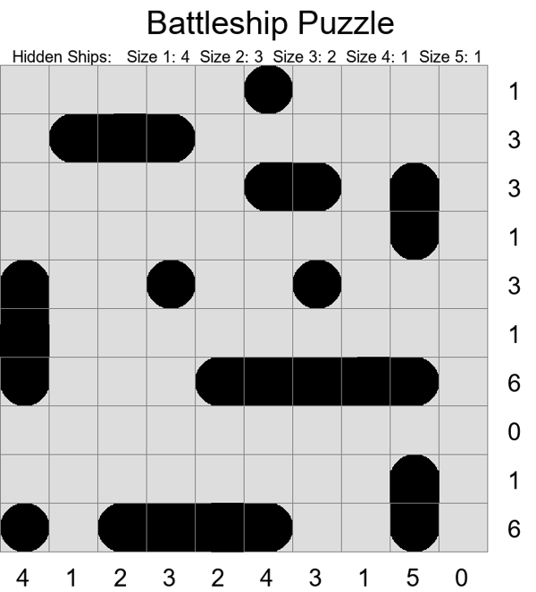

# 🚢💥 Battleship Solitaire Puzzle Generator

Ready to sink some ships? Battleship Solitaire is your ultimate solo puzzle challenge!

Rather than battling someone on the other side of the board, challenge yourself to identify all the battleship locations with just a few hints!

This project generates both a brand new, randomized battleship puzzle to solve alongside its solution counterpart.

Choose the size of the board, number of ships and max size of ships, and have endless fun solving battleships!

---

## 🎥 Demo  
**Puzzle Sheet**


**Answer Sheet**


---

## ✨ Features
- ✅ Generate randomized puzzles
- ✅ Configurable board size and ship count
- ✅ Exports puzzle & solutions as images

---

## 🚀 Installation  
1️⃣ Clone the repository:  
```sh
git clone https://github.com/blakeldridge/BattleshipSolitaire
cd BattleshipSolitaire
```

2️⃣ Install Dependencies:
```sh
    pip install pillow pandas
```

3️⃣ Generate the puzzle:
```sh
    python battleship.py 10 10 800
```
- `10 10` = rows x columns
- `800` = image width in pixels
- Allowed rows and columns shown in *settings.csv*

## ⚙️ Board Settings (settings.csv)
This files defines the allowed board sizes and the number of ships per size.

Each row represents one configuration.

```css
Width,Height,1,2,3,4,5,6
15,15,4,4,3,2,1,0
12,12,4,4,2,1,1,0
10,10,4,3,2,1,1,0
8,8,3,3,2,1,0,0
7,7,3,2,1,1,0,0
6,6,3,2,1,0,0,0
```
**Columns Explained**
- Width, Height -> Board dimensions
- 1, 2, 3, 4, 5, 6 -> ship sizes

✅ Example:
`10,10,4,3,2,1,1,0` means:
- Board size: 10×10
- Ships: 4 of size 1, 3 of size 2, 2 of size 3, 1 of size 4, 1 of size 5, 0 of size 6

⚠️ Only board sizes listed in `settings.csv` are supported.

## 🎮 How To Play

Check out : https://www.ultraboardgames.com/battleship/solitaire.php for the rules!

## 🔧 Technologies Used
- 🐍 Python
- 🖌️ PIL (Image manipulation)

## 📬 Contact
Created by **[Blake Eldridge](https://github.com/blakeldridge)** - Feel free to reach out! <br>
📧 **Email** : blakeldridge@gmail.com <br>
💼 **LinkedIn** : [blakeldridge](https://www.linkedin.com/in/blake-eldridge/)
